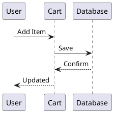
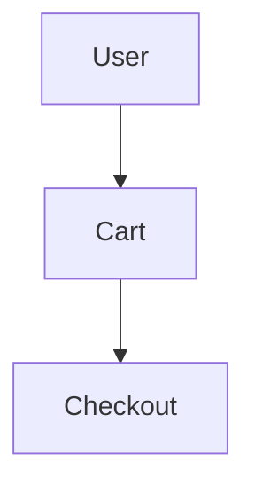

# VitePress 플러그인 사용 가이드

이 문서 사이트는 기능을 향상시키기 위해 12개의 VitePress 플러그인을 사용합니다.

## 1. PlantUML 다이어그램

마크다운에서 직접 PlantUML 다이어그램을 생성합니다:

````markdown

````

## 2. 비디오 임베딩

다양한 플랫폼의 비디오를 임베드합니다:

### YouTube
```markdown
@[youtube](video-id)
```

### Bilibili
```markdown
@[bilibili](bv-id)
```

### 커스텀 플레이어 (ArtPlayer)
```markdown
@[artplayer](video-url)
```

## 3. PDF 뷰어

PDF 파일을 문서에 직접 임베드합니다:

```markdown
@[pdf](path/to/file.pdf)
```

## 4. QR 코드 생성기

인라인으로 QR 코드를 생성합니다:

```markdown
@[qrcode](https://example.com)
```

커스텀 옵션 사용:
```markdown
@[qrcode options="{ width: 200, margin: 2 }"](https://example.com)
```

## 5. 단계별 가이드

번호가 매겨진 단계별 가이드를 생성합니다:

````markdown
:::steps

1. First step

   Details about the first step.

2. Second step

   Details about the second step.

3. Third step

   Final step details.

:::
````

## 6. 접을 수 있는 콘텐츠

접을 수 있는 섹션을 생성합니다:

````markdown
:::collapse Summary Title

Hidden content goes here. This will be collapsed by default.

:::
````

기본적으로 열려 있게 설정:
````markdown
:::collapse{open} Open by Default

This section is expanded initially.

:::
````

## 7. 텍스트 강조 표시 (Mark)

중요한 텍스트를 색상으로 강조 표시합니다:

```markdown
==This text is highlighted==
```

색상 지정:
```markdown
==Red highlight=={type="danger"}
==Green highlight=={type="success"}
==Blue highlight=={type="info"}
==Yellow highlight=={type="warning"}
```

## 8. 국제화 (i18n)

영어 로케일로 설정되어 있으며 쉽게 확장할 수 있습니다:

```typescript
const i18nOptions = {
  locales: ['en'],
  rootLocale: 'en'
}
```

언어를 추가하려면 설정을 업데이트하세요:
```typescript
const i18nOptions = {
  locales: ['en', 'ko', 'zhHans'],
  rootLocale: 'en'
}
```

## 9. Mermaid 다이어그램

Mermaid 문법을 사용하여 다이어그램을 생성합니다:

````markdown

````

## 10. 탭 콘텐츠

대체 콘텐츠를 위한 탭을 생성합니다:

````markdown
:::tabs
== npm
```bash
npm install mycart
```

== bun
```bash
bun add mycart
```
:::
````

## 11. Kroki 다이어그램

Kroki를 통해 20종 이상의 다이어그램 유형을 지원합니다:

````markdown

````

지원: PlantUML, GraphViz, Mermaid, D2, DBML, Excalidraw 등.

## 12. LLM 친화적 문서

자동으로 다음을 생성합니다:
- `llms.txt` - 문서 인덱스
- `llms-full.txt` - 전체 번들

복사/다운로드 버튼 추가:
```vue
<CopyOrDownloadAsMarkdownButtons />
```

## 전체 설정

`.vitepress/config.mts`:

```typescript
import { defineConfig } from 'vitepress'
import { withMermaid } from 'vitepress-plugin-mermaid'
import { tabsMarkdownPlugin } from 'vitepress-plugin-tabs'
import { configureDiagramsPlugin } from 'vitepress-plugin-diagrams'
import llmstxt, { copyOrDownloadAsMarkdownButtons } from 'vitepress-plugin-llms'
import { withI18n } from 'vitepress-i18n'
import { plantumlMarkdownPlugin, plantumlVitePlugin } from 'vitepress-plugin-plantuml'
import { videoMarkdownPlugin } from 'vitepress-plugin-video'
import { pdfMarkdownPlugin } from 'vitepress-plugin-pdf'
import { qrcodeMarkdownPlugin } from 'vitepress-plugin-qrcode'
import { stepsMarkdownPlugin } from 'vitepress-plugin-steps'
import { collapseMarkdownPlugin } from 'vitepress-plugin-collapse'
import { markdownPlugin } from 'vitepress-plugin-mark'

const vitePressConfig = withMermaid(defineConfig({
  vite: {
    plugins: [llmstxt(), plantumlVitePlugin()]
  },
  markdown: {
    config(md) {
      md.use(tabsMarkdownPlugin)
      md.use(configureDiagramsPlugin, { krokilUrl: 'https://kroki.io' })
      md.use(copyOrDownloadAsMarkdownButtons)
      md.use(plantumlMarkdownPlugin)
      md.use(videoMarkdownPlugin, {
        artplayer: true,
        youtube: true,
        bilibili: true,
        acfun: true
      })
      md.use(pdfMarkdownPlugin)
      md.use(qrcodeMarkdownPlugin)
      md.use(stepsMarkdownPlugin)
      md.use(collapseMarkdownPlugin)
      md.use(markdownPlugin)
    },
    languageAlias: { plantuml: 'txt' }
  },
  mermaid: { theme: 'default' }
}))

const i18nOptions = {
  locales: ['en'],
  rootLocale: 'en'
}

export default withI18n(vitePressConfig, i18nOptions)
```

`.vitepress/theme/index.ts`:

```typescript
import DefaultTheme from 'vitepress/theme'
import type { Theme } from 'vitepress'
import { enhanceAppWithTabs } from 'vitepress-plugin-tabs/client'
import { enhanceAppWithPlantuml } from 'vitepress-plugin-plantuml/client'
import { enhanceAppWithVideo } from 'vitepress-plugin-video/client'
import { enhanceAppWithPDF } from 'vitepress-plugin-pdf/client'
import { enhanceAppWithQrcode } from 'vitepress-plugin-qrcode/client'
import { enhanceAppWithCollapse } from 'vitepress-plugin-collapse/client'
import { enhanceAppWithMark } from 'vitepress-plugin-mark/client'
import 'vitepress-plugin-steps/style.css'

export default {
  extends: DefaultTheme,
  enhanceApp(ctx) {
    enhanceAppWithTabs(ctx.app)
    enhanceAppWithPlantuml(ctx)
    enhanceAppWithVideo(ctx)
    enhanceAppWithPDF(ctx)
    enhanceAppWithQrcode(ctx)
    enhanceAppWithCollapse(ctx)
    enhanceAppWithMark(ctx)
  }
} satisfies Theme
```

## 플랫폼 참고 사항

**VitePress 2.x 요구 사항**: 새로 추가된 8개 플러그인(plantuml, video, pdf, qrcode, steps, collapse, mark, i18n)은 모두 `rolldown`을 번들러로 사용하는 VitePress 2.0.0-alpha.19 이상이 필요합니다. Rolldown은 현재 OpenBSD를 지원하지 않습니다. Linux, macOS, Windows에서 테스트 및 빌드하세요.
