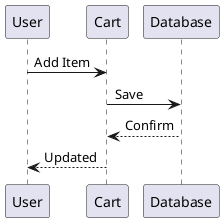
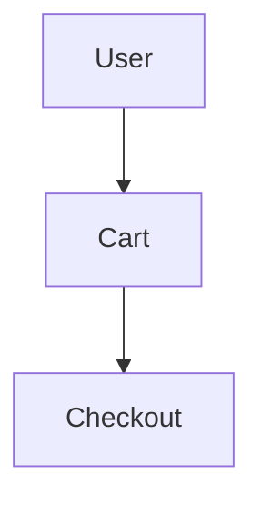
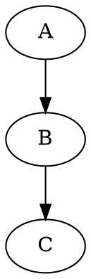

# VitePress Plugins Usage Guide

This documentation site uses 12 VitePress plugins to enhance functionality.

## 1. PlantUML Diagrams

Create PlantUML diagrams directly in markdown:

````markdown

````

## 2. Video Embedding

Embed videos from multiple platforms:

### YouTube
```markdown
@[youtube](video-id)
```

### Bilibili
```markdown
@[bilibili](bv-id)
```

### Custom Player (ArtPlayer)
```markdown
@[artplayer](video-url)
```

## 3. PDF Viewer

Embed PDF files directly in your documentation:

```markdown
@[pdf](path/to/file.pdf)
```

## 4. QR Code Generator

Generate QR codes inline:

```markdown
@[qrcode](https://example.com)
```

With custom options:
```markdown
@[qrcode options="{ width: 200, margin: 2 }"](https://example.com)
```

## 5. Step-by-Step Guides

Create numbered step guides:

````markdown
:::steps

1. First step

   Details about the first step.

2. Second step

   Details about the second step.

3. Third step

   Final step details.

:::
````

## 6. Collapsible Content

Create collapsible sections:

````markdown
:::collapse Summary Title

Hidden content goes here. This will be collapsed by default.

:::
````

Open by default:
````markdown
:::collapse{open} Open by Default

This section is expanded initially.

:::
````

## 7. Text Highlighting (Mark)

Highlight important text with color:

```markdown
==This text is highlighted==
```

With colors:
```markdown
==Red highlight=={type="danger"}
==Green highlight=={type="success"}
==Blue highlight=={type="info"}
==Yellow highlight=={type="warning"}
```

## 8. Internationalization (i18n)

Configured for English locale with easy expansion:

```typescript
const i18nOptions = {
  locales: ['en'],
  rootLocale: 'en'
}
```

To add more languages, update the config:
```typescript
const i18nOptions = {
  locales: ['en', 'ko', 'zhHans'],
  rootLocale: 'en'
}
```

## 9. Mermaid Diagrams

Create diagrams using Mermaid syntax:

````markdown

````

## 10. Tabbed Content

Create tabs for alternative content:

````markdown
:::tabs
== npm
```bash
npm install mycart
```

== bun
```bash
bun add mycart
```
:::
````

## 11. Kroki Diagrams

Support for 20+ diagram types via Kroki:

````markdown

````

Supported: PlantUML, GraphViz, Mermaid, D2, DBML, Excalidraw, and more.

## 12. LLM-Friendly Documentation

Automatically generates:
- `llms.txt` - Documentation index
- `llms-full.txt` - Complete bundle

Add copy/download buttons:
```vue
<CopyOrDownloadAsMarkdownButtons />
```

## Complete Configuration

`.vitepress/config.mts`:

```typescript
import { defineConfig } from 'vitepress'
import { withMermaid } from 'vitepress-plugin-mermaid'
import { tabsMarkdownPlugin } from 'vitepress-plugin-tabs'
import { configureDiagramsPlugin } from 'vitepress-plugin-diagrams'
import llmstxt, { copyOrDownloadAsMarkdownButtons } from 'vitepress-plugin-llms'
import { withI18n } from 'vitepress-i18n'
import { plantumlMarkdownPlugin, plantumlVitePlugin } from 'vitepress-plugin-plantuml'
import { videoMarkdownPlugin } from 'vitepress-plugin-video'
import { pdfMarkdownPlugin } from 'vitepress-plugin-pdf'
import { qrcodeMarkdownPlugin } from 'vitepress-plugin-qrcode'
import { stepsMarkdownPlugin } from 'vitepress-plugin-steps'
import { collapseMarkdownPlugin } from 'vitepress-plugin-collapse'
import { markdownPlugin } from 'vitepress-plugin-mark'

const vitePressConfig = withMermaid(defineConfig({
  vite: {
    plugins: [llmstxt(), plantumlVitePlugin()]
  },
  markdown: {
    config(md) {
      md.use(tabsMarkdownPlugin)
      md.use(configureDiagramsPlugin, { krokilUrl: 'https://kroki.io' })
      md.use(copyOrDownloadAsMarkdownButtons)
      md.use(plantumlMarkdownPlugin)
      md.use(videoMarkdownPlugin, {
        artplayer: true,
        youtube: true,
        bilibili: true,
        acfun: true
      })
      md.use(pdfMarkdownPlugin)
      md.use(qrcodeMarkdownPlugin)
      md.use(stepsMarkdownPlugin)
      md.use(collapseMarkdownPlugin)
      md.use(markdownPlugin)
    },
    languageAlias: { plantuml: 'txt' }
  },
  mermaid: { theme: 'default' }
}))

const i18nOptions = {
  locales: ['en'],
  rootLocale: 'en'
}

export default withI18n(vitePressConfig, i18nOptions)
```

`.vitepress/theme/index.ts`:

```typescript
import DefaultTheme from 'vitepress/theme'
import type { Theme } from 'vitepress'
import { enhanceAppWithTabs } from 'vitepress-plugin-tabs/client'
import { enhanceAppWithPlantuml } from 'vitepress-plugin-plantuml/client'
import { enhanceAppWithVideo } from 'vitepress-plugin-video/client'
import { enhanceAppWithPDF } from 'vitepress-plugin-pdf/client'
import { enhanceAppWithQrcode } from 'vitepress-plugin-qrcode/client'
import { enhanceAppWithCollapse } from 'vitepress-plugin-collapse/client'
import { enhanceAppWithMark } from 'vitepress-plugin-mark/client'
import 'vitepress-plugin-steps/style.css'

export default {
  extends: DefaultTheme,
  enhanceApp(ctx) {
    enhanceAppWithTabs(ctx.app)
    enhanceAppWithPlantuml(ctx)
    enhanceAppWithVideo(ctx)
    enhanceAppWithPDF(ctx)
    enhanceAppWithQrcode(ctx)
    enhanceAppWithCollapse(ctx)
    enhanceAppWithMark(ctx)
  }
} satisfies Theme
```

## Platform Note

**VitePress 2.x requirement**: All 8 new plugins (plantuml, video, pdf, qrcode, steps, collapse, mark, i18n) require VitePress 2.0.0-alpha.19+, which uses `rolldown` as its bundler. Rolldown currently does not support OpenBSD. Test and build on Linux, macOS, or Windows.
